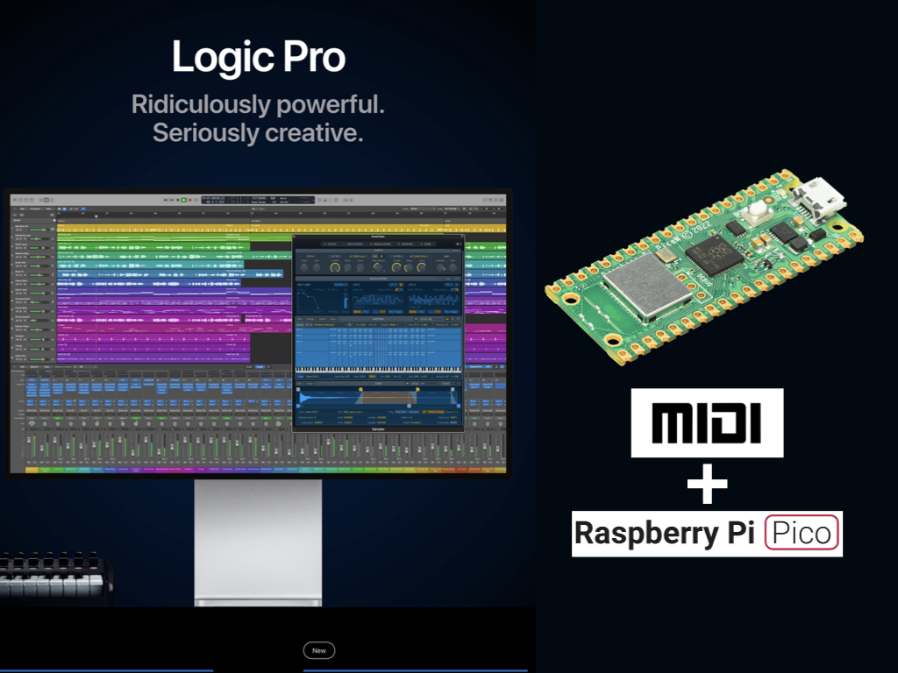

# MIDI on RaspberryPI Pico

This repository contains the files for a tutorial on how to use Raspberry PI Pico with MIDI and Logic Pro (digital audio workstation).

For a tutorial on how to use the provided examples code (Python Client) and how to configure the server (ServerJS), please refer to this [YouTube video](https://www.youtube.com/watch?v=C1FenOYgSgs).
